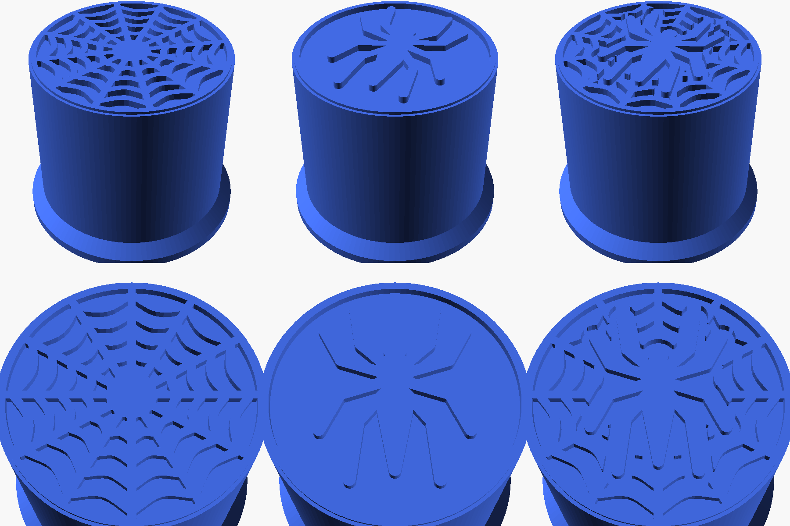

# Ejetor de teia do Homem-Aranha (cilíndrico)

Peça única cilíndrica com aba na base e desenho em relevo no topo. Medida total: **35 × 35 × 30 mm** (X × Y × Z).

| Arquivo | Desenho no topo |
|---|---|
| `ejetor-teia.stl` | Teia |
| `ejetor-aranha.stl` | Aranha (emblema) |
| `ejetor-teia-aranha.stl` | Teia com a aranha no meio |
| `ejetor.scad` | Arquivo editável (OpenSCAD) com as medidas como parâmetros |

Medidas: aba da base Ø35 × 3 mm · corpo Ø31 mm · borda do topo 1.2 mm · relevo de 1.0 mm.

## Como imprimir (bico 0.4)

- **Orientação**: em pé, com a aba no prato (já vem assim). **Sem suporte e sem brim.**
- Altura de camada: **0.2 mm** (o relevo tem exatamente 5 camadas)
- Paredes: 3 · Topo/fundo: 4 camadas · Preenchimento: 15–20 %
- Perímetro externo a ~40 mm/s para o desenho sair limpo
- PLA ou PETG

## Por que não entope nem força a impressora

- Fios da teia com 1.0 mm e pernas da aranha com 1.4 mm (2 a 3 linhas de extrusão): nada mais fino que o bico consegue fazer.
- Nenhuma saliência acima de 45° nem ponte: a aba tem rampa de 45° até o corpo, e o bico não arrasta fio solto.
- Chanfro de 0.5 mm na base, para evitar "pé de elefante", e borda de cima chanfrada.
- Malhas fechadas (manifold) e conferidas, sem erros para o fatiador corrigir.

## Mudar medidas

Abra `ejetor.scad` no OpenSCAD, altere `diametro_base`, `altura` ou `desenho` e exporte (F6 → F7).
